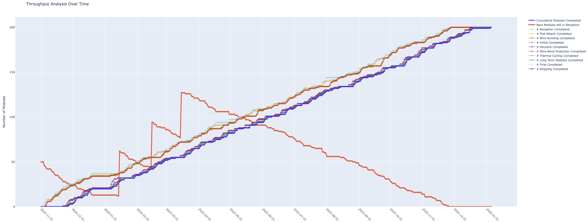
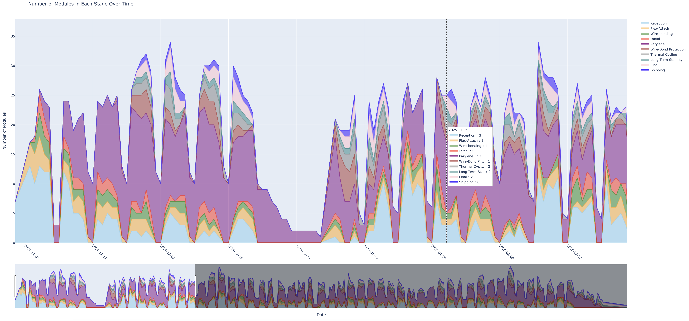
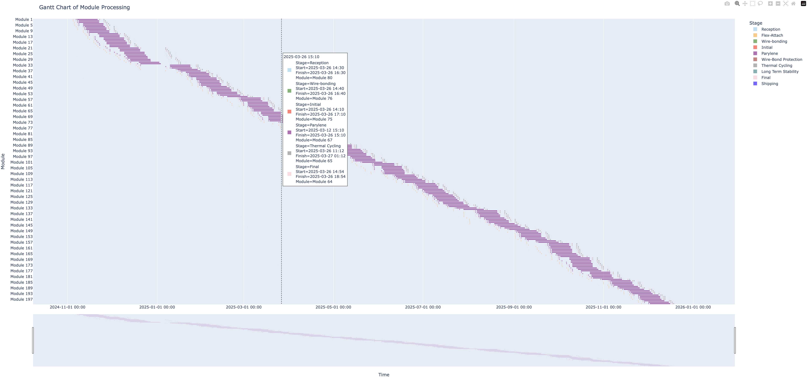
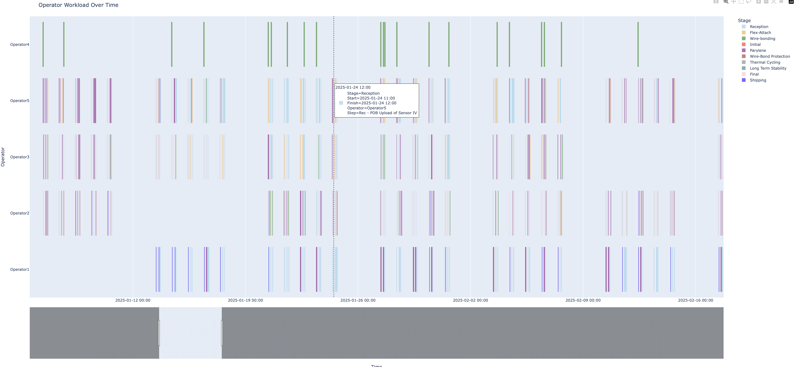

# Module Production Throughput Simulation

This repository contains a Python script designed to simulate the production throughput of ITk Pixel Quad Modules. The script is highly configurable via a JSON file and generates several plots to visualise the module production pipeline, including throughput analysis, module scheduling, and operator workload.

## Overview

The script simulates the production process of modules through all stages and steps, handling component arrivals, operator assignments, and capacity changes over time. It schedules each module's progression through the production stages and generates the following visual plots:

1. **Throughput Analysis Over Time**: Shows the cumulative number of modules completed and still in reception at any given point.



2. **Number of Modules in Each Stage Over Time**: Depicts how many modules are present in each stage over time.



3. **Gantt Chart of Module Processing**: Visualises the timeline for processing each module across all stages.



4. **Operator Workload Over Time**: Highlights the workload of operators, indicating their assigned tasks and time periods.



### Features

- **Dynamic Scheduling**: The script dynamically schedules modules through production steps based on the available capacity and operator availability.
- **Component Arrival Simulation**: The script handles the staggered arrival of bare components (i.e. bare modules and flexes).
- **Time Granularity**: Adjustable time granularity (default: 15 minutes) allows for fine or coarse scheduling.
- **Operator Holiday Simulation**: Includes the ability to simulate operator holidays, ensuring that tasks are not assigned to unavailable operators.
- **Capacity Changes**: Parallelisation capacities of stages and steps can be made to change over time, simulating increased parallelisation or resource availability.

## Requirements

To run this script, the following packages are required:

- Python 3.x
- Pandas (`pip install pandas`)
- Plotly (`pip install plotly`)
- tqdm (`pip install tqdm`)
- numpy (`pip install numpy`)

## Usage Instructions

1. Clone the repository to your local machine:
```bash
git clone https://gitlab.cern.ch/absharma/itk-module-production-simulator/
```

2. Ensure the JSON configuration file (`SimulatorInputs.json`) is located in the same directory as the script.

3. The main script to run is `ModuleProductionThroughput.py`. Execute it using the following command:
```bash
python ModuleProductionThroughput.py
```

4. Upon running the script, the following plots will be generated:
   - **Throughput Analysis Over Time**
   - **Number of Modules in Each Stage Over Time**
   - **Gantt Chart of Module Processing**
   - **Operator Workload Over Time**

These plots will be displayed interactively and provide insights into the production process, showing how modules progress through stages, the operator workload, and bottlenecks in the system.

## JSON Configuration

The script is configured via a JSON file (`SimulatorInputs.json`). The key sections of the JSON file are:

### 1. **Simulation Parameters**
Defines the main simulation parameters:
```json
{
    "SimulationParameters": {
        "num_modules": 35,
        "simulation_start": "2024-11-01T09:00:00",
        "transition_delay": 10,
        "parylene_shipment_weekday": 4
    }
}
```
- **num_modules**: Number of modules to simulate.
- **simulation_start**: The starting date and time for the simulation.
- **transition_delay**: Delay (in minutes) between stages when transitioning from one step to the next (i.e. losing 10 minutes when shifting from visual inspection setup to sensor IV probe station).
- **parylene_shipment_weekday**: Fixed day of the week when shipments will occur (0=Monday, 6=Sunday).

### 2. **Component Arrival Times**
Defines when bare component batches arrive:
```json
{
    "ComponentArrivalTimes": {
        "bare modules": {
            "2024-11-01T09:00:00": 15,
            "2024-11-25T09:00:00": 20
        },
        "flexes": {
            "2024-11-10T09:00:00": 20,
            "2024-12-03T09:00:00": 15
        }
    }
}
```
Each component arrival specifies the date and time, and the number of bare components arriving at that time.

### 3. **Work Hours**
Defines the working hours and working days of the week:
```json
{
    "WorkHours": {
        "work_start": "09:00:00",
        "work_end": "18:00:00",
        "lunch_start": "12:00:00",
        "lunch_end": "13:00:00",
        "work_days": [0, 1, 2, 3, 4]
    }
}
```
- **work_days**: Days of the week considered as working days (0=Monday, 6=Sunday).


### 4. **Operator Work Hours**
This section defines the working schedule for each operator, specifying the hours they are available on different days of the week. For instance, the example below shows that *Operator1* is available from **09:00 AM to 06:00 PM** on both **Monday** and **Tuesday**. Operators may have different working hours or be unavailable on other days.

```json
{
    "OperatorWorkHours": {
        "Operator1": {
            "Monday": [{"start": "09:00:00", "end": "18:00:00"}],
            "Tuesday": [{"start": "09:00:00", "end": "18:00:00"}]
        }
    }
}
```

---

### 5. **CERN Holidays**
This section defines the CERN holidays, during which no work will take place.

```json
{
    "CERNHolidays": [
        ["2024-12-21", "2025-01-05"],
        ["2025-04-18", "2025-04-21"],
        ...
    ]
}
```

During these holidays, no tasks or processes can be scheduled, regardless of operator availability.

---

### 6. **Operator Holidays**
This section defines personal holidays for each operator. For example, *Operator1* will be on holiday from **2025-01-06** to **2025-01-10**, *Operator2* from **2025-01-13** to **2025-01-17**, and so on. Each operator has their own set of holidays, which are considered in addition to the CERN holidays.

```json
{
    "OperatorHolidays": {
        "Operator1": [
            ["2025-01-06", "2025-01-10"],
            ...
        ],
        "Operator2": [
            ["2025-01-13", "2025-01-17"],
            ...
        ]
    }
}
```

On these dates, the corresponding operator will not be available, even if CERN is open.

---

### 7. **Operators**
This section specifies the tasks that each operator is qualified to perform. Here, *Operator1* has a subset of tasks they can handle, like "Storage of bare modules" or "Detailed Visual inspection of flexes". *Operator2*, *Operator3*, and *Operator5*, on the other hand can perform all tasks except for wire-bonding, while *Operator4* specializes only in wire-bonding.

```json
{
    "Operators": {
        "Operator1": [
            "Storage of bare modules", "Detailed Visual inspection of bare modules", ...
        ],
        "Operator2": "All_except_wire_bonding",
        "Operator3": "All_except_wire_bonding",
        "Operator4": ["Wire-bonding"],
        "Operator5": "All_except_wire_bonding"
    }
}
```

This section helps in allocating the right operator to specific tasks when scheduling.

---

### 8. **Steps Requiring Operator**
This section lists the steps in the production process that specifically require an operator to be present. For example, steps like "Storage of bare modules" and "Detailed Visual inspection of flexes" need an operator to be physically present to perform the task. These steps cannot proceed without an operator being available.

```json
{
    "StepsRequiringOperator": [
        "Storage of bare modules", "Detailed Visual inspection of bare modules", ...
    ]
}
```

---

### 9. **Steps Launched by Operator**
Certain steps need to be initiated by an operator, but the operator does not need to stay for the entire duration of the process. These steps include for example "Thermal Cycling", "Flex-Attach Glue curing", and "Shipping". The operator will only be required to launch the process and can then leave.

```json
{
    "StepsLaunchByOperator": [
        "Cycle", "Flex-Attach Glue curing", "Shipping", ...
    ]
}
```
